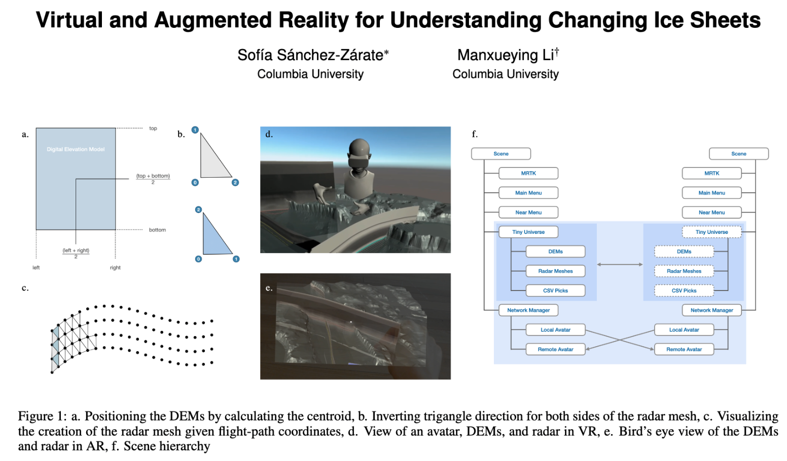

# ARVR application on Hololens & Oculus Quest for visualizing icesheet in Greenland!

An application under development that uses MRTK in Unity in order to see Greenland's topography and ice sheets.

Check out our [Video Demo](https://youtu.be/aF3NYQ5JKlc)

Contributors:
* [Me](https://github.com/lmxy0212), Columbia University
* [Sofia Sanchez](https://github.com/sofiasanchez985), Columbia University

Advising:
Object files created by Alexandra Boghosian.

Working under our advisors Professor Steven Feiner, Alexandra Boghosian, and Carmine Elvezio.

